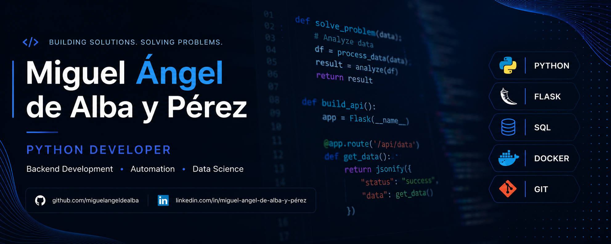

  

# 👋 Hi, I'm Miguel Ángel de Alba y Pérez

### Python Backend Developer • Applied Data Science Student

Building practical software with Python, Backend Development, Automation, REST APIs and Data Analysis.

 

---

# 🚀 About Me

🎓 Higher Technician in Multiplatform Application Development (DAM)

🎓 Higher Technician in Audiovisual Projects & Live Events

📚 Applied Data Science Student at Universitat Oberta de Catalunya (UOC)

💼 Interested in Backend Development, Python Automation, REST APIs and Data Analysis.

I enjoy building practical software, automating repetitive tasks and creating solutions focused on real-world problems.

---

# 💼 Professional Experience

- 🎬 Audiovisual Editor & Motion Graphics
- 🎭 Stage & Animatronics Technician
- 🐍 Python Backend Development
- 📊 Data Analysis Projects

---

# 💻 Tech Stack

---

# ⭐ Featured Projects

## 🦷 OdontoCare API

REST API developed with **Python** and **Flask**, implementing JWT authentication, CRUD operations, SQL database management and a clean backend architecture.

### 🔗 [View Repository](https://github.com/miguelangeldealba/odontocare-api)

---

## 📈 Open Finance Analysis

Financial data analysis project using Python, Pandas and Jupyter Notebook to clean, analyse and visualize financial datasets.

### 🔗 [View Repository](https://github.com/miguelangeldealba/open-finance-analysis)

---

## 🐍 Python Learning Journey

A structured collection of Python exercises and projects documenting my progression from the fundamentals to backend development and automation.

### 🔗 [View Repository](https://github.com/miguelangeldealba/python-learning-journey)

---

## 🌱 Viveros El Ciprés

Corporate website developed for a real business using modern web development practices.

### 🔗 [View Repository](https://github.com/miguelangeldealba/viveros-el-cipres)

---

# 📊 GitHub Activity

---

# 🚀 What I'm Working On

- 🔭 Developing REST APIs with Flask
- 🐍 Improving Python Backend Development
- 📊 Building Data Analysis projects with Pandas
- 🎓 Studying Applied Data Science at UOC
- 💼 Looking for Junior Python / Backend Developer opportunities

---

# 📚 Currently Learning

---

# 🌍 Languages

- 🇪🇸 Spanish — Native
- 🇬🇧 English — Professional Working Proficiency (B2)
- 🇫🇷 French — Basic (A1)

---

# 📫 Contact

---
